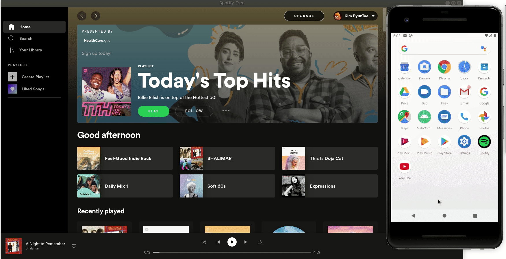

# MeloCommunity

## Table of Contents
1. [Overview](#Overview)
2. [Product Spec](#Product-Spec)
3. [Wireframes](#Wireframes)
4. [Schema](#Schema)
5. [Walkthrough](#Walkthrough)

## Overview
### Description
Combining Spotify, Instagram, and Reddit, MeloCommunity is a platform for music lovers. Users log in with thier Spotify accounts and they can control the music through the app, read and post comments on their top played songs, and search for new songs and see what people think of them. MeloCommunity provides people a way to interact and connect through music.

### App Evaluation
- **Category**: Music, Entertainment, Forums, Social Networking
- **Mobile**: Mobile is essential for user convinience and targets our demographic.
- **Story**: Creates a post out of a song that is the centerpiece for discussion.
- **Market**: Spotify and other music enthusiasts that want to discuss music with a community.
- **Habit**: Users are using this whenever they are introduced to a new song or are passionate about a song they heard.
- **Scope**: V1 Allow users to search and view a song post in detail that has a comment section for discussion. V2 Would include verified arist accounts.

## Product Spec

### 1. User Stories (Required and Optional)

**Required Must-have Stories**

* [x] As a user I should be able to log into my spotify account
* [x] As a user I should be able to see a feed of songs
* [x] As a user I should see currently playing/last played song's title
* [x] As a user I should see currently playing/last played song's image
* [x] As a user I should be able to play a song
* [x] As a user I should be able to pause a song
* [x] As a user I should be able to play next and previous songs
* [x] As a user I should be able to add a song to my personal library
* [x] As a user I should be able to see comments on a post
* [x] As a user I should be able to comment on a post

**Optional Nice-to-have Stories**

* [x] As a user I should be able to view my own profile
* [x] As a user I should be able to search a song
* [x] As a user I should be able to delete my own comments
* [ ] As a user I should be able to edit my own comments
* [ ] As a user I should be able to play a song I searched
* [ ] As a user I should be able to play a song directly from the feed screen
* [ ] As a user I should be able to play a song directly from the detail screen
* [ ] As a user I should be able to play a click currently playing song and get to it's detail screen

### 2. Screen Archetypes
* Splash Screen
   * As a user I should be able to log in to my spotify account
* Feed Screen
   * As a user I should be able to see a feed of posts, play/pause/skip songs, add a song to my personal library,  comment on a post, see comments on a post, and delete commetns.
* Account Screen
   * As a user I should be able to see my personal information that includes my displayed name and profile picture.
* Search Screen
   * As a user I should be able to search songs with live results (like google search), see their comments, comment and delete commetns of my own.

### 3. Navigation

**Tab Navigation** (Tab to Screen)

* Account
* Feed
* Search

**Flow Navigation** (Screen to Screen)

* Splash
   => Login
* Login
   => Account 
* Account 
   => Feed 
* Account 
   => Search 
* Feed
   => Detail
* Search
   => Detail

## Wireframes

### [BONUS] Interactive Prototype

## Schema 
### Models
#### User
 | Property      | Type     | Description |
   | ------------- | -------- | ------------|
   | userId      | String   | user's Spotify id  |
   | image         | Image     | user's Spotify profile picture |
   | top songs       | Arraylist of Songs   | list of user's top played songs |
   
#### Song
 | Property      | Type     | Description |
   | ------------- | -------- | ------------|
   | songId      | String   | song's id  |
   | nameSong         | String     |  name of song |
   | nameArtist     | String  | name of artist |
   | image         | Image     |  image of song/album |
   | comments     |  Arraylist of Comments  | comments on this specific song |
   | createdAt     |  DateTime  |  date song was created at |

   
#### Comment 
 | Property      | Type     | Description |
   | ------------- | -------- | ------------|
   | songId      | String   | song's Id |
   | commentId         | String     | comment’s unique id |
   | userId     | String  |  the id of the user who left the comment |
   | createdAt      | DateTime  | time comment was posted |
   | description         | Text     |  the actual comment's text  |
   
   
### Networking
#### List of network requests by screen

  - Profile screen
    - (Read/GET) Query logged in user object
  - Feed Screen
    - (Read/GET) Query top played songs of user 
    - (Read/GET) Query commetns of each song
    - (Create/POST) Create a new comment on a song
    - (Delete) Delete an existing comment by user
  - Search Screen
    - (Read/GET) Query searched songs by input
    - (Read/GET) Query commetns of each song that was found
    - (Create/POST) Create a new comment on a song
    - (Delete) Delete an existing comment by user
  - Detail Screen
    - (Create/POST) Create a new comment on a post/song
    - (Update/PUT) Edit an existing comment
    - (Delete) Delete an existing comment
    
#### [OPTIONAL:] Existing API Endpoints
##### Spotify API
- Base URL - [https://api.spotify.com/v1/] 

   HTTP Verb | Endpoint | Description
   ----------|----------|------------
    `GET`    | /tracks | query all top songs of the user 
    `GET`    | /me   | query logged in user object
    `GET`    | /me/player/currently-playing   | query currently played song
    `GET`    | /me/player/recently-playing   | query recently played song
    `GET`    | /search/	 |  query tracks by keywords

    
## Logo

## Walkthrough

Here's a Walkthrough of implemented user stories:

